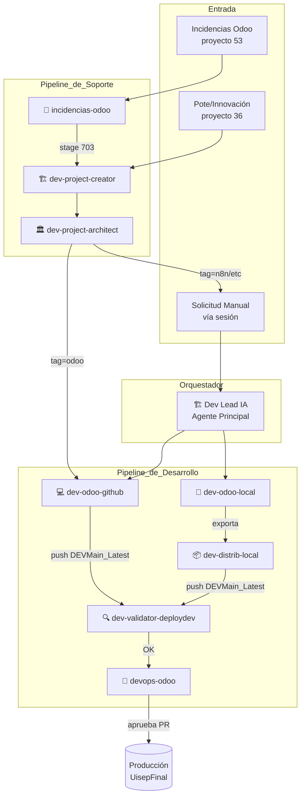

# OpenClaw Developer IA — Universidad ISEP

Sistema multiagente de IA para gestión completa del ciclo de vida de desarrollo Odoo 16.

**Puerto:** `18797` → `18789` interno  
**Servidor:** `192.168.100.58` (Nvidia-Coolify)  
**Modelo principal:** MiniMax-M2.5 (200k contexto, reasoning)  
**Fallback:** Ollama qwen2.5-7b-gpu (local)

---

## Visión General



---

## Documentación

| Documento | Descripción |
|-----------|-------------|
| [Arquitectura](docs/ARCHITECTURE.md) | Arquitectura del sistema, infraestructura y conexiones |
| [Agentes](docs/AGENTS.md) | Referencia completa de cada agente |
| [Workflows](docs/WORKFLOWS.md) | Diagramas de flujo de todos los procesos |
| [Infraestructura](docs/INFRASTRUCTURE.md) | Servidores, contenedores y redes |

---

## Inicio Rápido

```bash
# Levantar el sistema
cd /data/openclaw-developer-ia
docker compose up -d

# Ver logs del agente principal
docker logs -f openclaw-developer-ia

# Verificar salud
curl http://localhost:18797/health

# Ver sesiones activas
ls sessions/*.jsonl
```

---

## Agentes (resumen)

| Agente | Emoji | Propósito | Heartbeat |
|--------|-------|-----------|-----------|
| `main` | 🏗️ | Orquestador del equipo dev | 30 min |
| `dev-odoo-github` | 💻 | Desarrollo Odoo + push GitHub → Jenkins | On-demand |
| `dev-odoo-local` | 🔧 | Desarrollo Odoo en contenedor local | On-demand |
| `dev-distrib-local` | 📦 | Distribuye cambios locales a DEV | On-demand |
| `dev-validator-deploydev` | 🔍 | Valida deploy automático en DEV | On-demand |
| `devops-odoo` | 🚀 | Revisa PRs y valida deploy en Producción | 60 min |
| `incidencias-odoo` | 🎫 | Atiende tickets del helpdesk | 30 min (cron) |
| `dev-project-creator` | 📋 | Convierte tickets en proyectos de desarrollo | 60 min |
| `dev-project-architect` | 🏛️ | Asigna herramienta tecnológica óptima | 60 min |

---

## Stack Tecnológico

| Componente | Tecnología |
|-----------|-----------|
| Framework de agentes | [OpenClaw](https://openclaw.ai) |
| Runtime | Node.js 22 |
| Modelo IA principal | MiniMax-M2.5 (200k ctx) |
| Modelo IA local | Ollama qwen2.5-7b-gpu |
| ERP objetivo | Odoo 16 |
| CI/CD | Jenkins |
| Control de versiones | GitHub (`Universidad-ISEP/Odoo16UISEP`) |
| Base de datos producción | PostgreSQL 14 (`UisepFinal`) |
| Proxy | Traefik (servidor .57) |
