# Referencia de Agentes

## Mapa de Interacciones

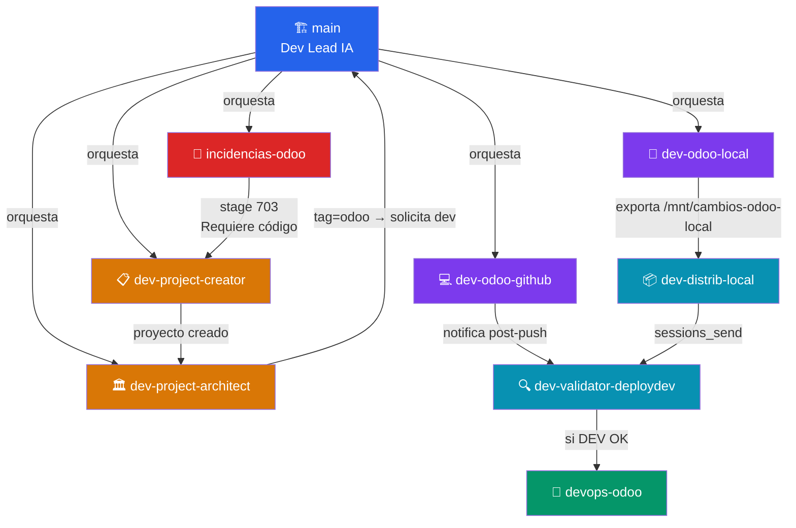

---

## 🏗️ main — Dev Lead IA

**Propósito:** Orquestador principal. Coordina a todos los sub-agentes y gestiona el flujo general del equipo de desarrollo.

**Heartbeat:** cada 30 min con `ollama/qwen2.5-7b-gpu` (ligero)

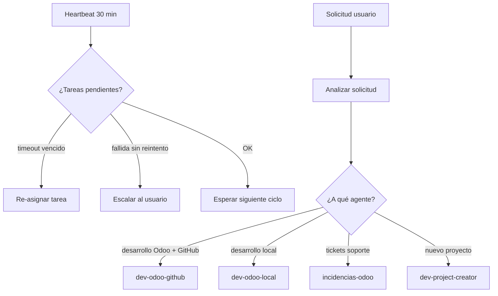

**Herramientas disponibles:** `group:fs`, `group:runtime`, `group:sessions`, `group:web`, `exec`

---

## 💻 dev-odoo-github

**Propósito:** Implementar cambios de código Odoo 16 en el servidor DEV y hacer push a `DEVMain_Latest`. Jenkins despliega automáticamente.

**Entorno de trabajo:**

| Parámetro | Valor |
|-----------|-------|
| Servidor | 189.195.191.16 (SSH) |
| Llave SSH | `/.keys/odoo-dev.pem` |
| Repo local | `/home/maikel/github/Odoo16UISEP_DEVMain` |
| Addons path | `addons-extra/addons_uisep` |
| Rama de trabajo | `DEVMain_Latest` |
| DB DEV | `final` |
| URL DEV | `https://dev.odoo.universidadisep.com` |
| Contenedor | `odoo_latest-w8co804sck0ssc0swkcgw488` |

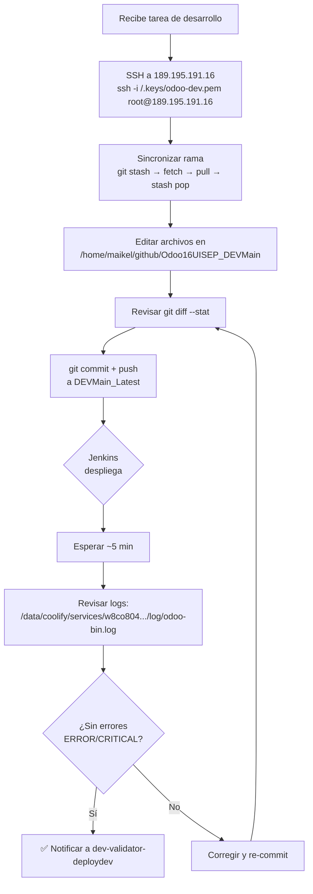

**Reglas críticas:**
- ⛔ NUNCA tocar rama `main`
- ⛔ NUNCA reiniciar Odoo DEV manualmente
- ⛔ NUNCA forzar push (`--force`)
- ✅ SIEMPRE hacer `git pull` antes de editar
- ✅ `search_read` antes de cualquier `write` o `unlink` RPC

---

## 🔧 dev-odoo-local

**Propósito:** Desarrollar cambios en el contenedor Odoo local (`/data/odoo-migration`). NO hace push a GitHub — exporta cambios para que `dev-distrib-local` los procese.

**Entorno de trabajo:**

| Parámetro | Valor |
|-----------|-------|
| Contenedor | `odoo-app-prod` (LOCAL, sin SSH) |
| Addons en container | `/mnt/odoo-migration-addons/addons_uisep` |
| Addons en host | `/data/odoo-migration/odoo16/addons-extra` |
| Carpeta exportación | `/mnt/cambios-odoo-local/<modulo>/` |
| URL | `https://dev3.odoo.universidadisep.com` |
| DB | `UisepFinal` |

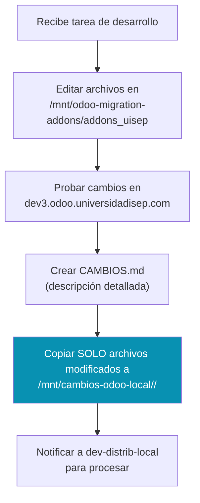

**Reglas:**
- ⛔ NUNCA copiar módulos completos — solo archivos modificados
- ⛔ NUNCA tocar contenedores de producción
- ✅ SIEMPRE crear `CAMBIOS.md` con descripción detallada
- ✅ La carpeta de exportación es el único canal de salida

---

## 📦 dev-distrib-local

**Propósito:** Recoger cambios de `/mnt/cambios-odoo-local` y distribuirlos al repositorio DEV vía SSH.

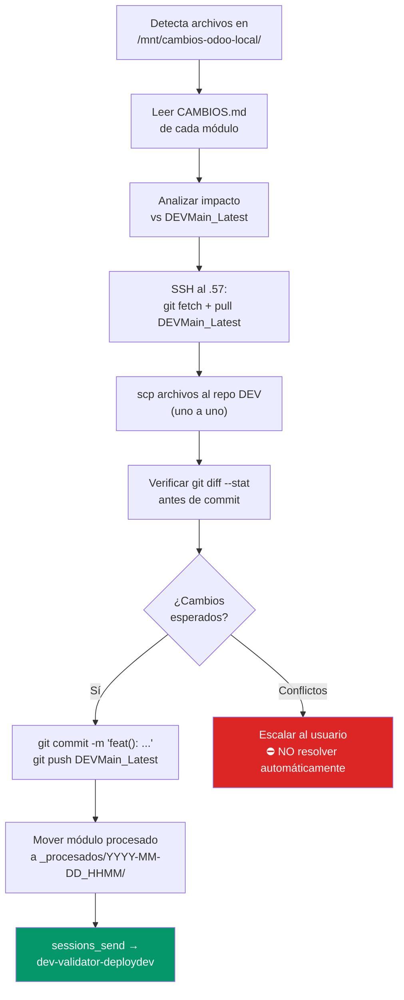

**Reglas:**
- ✅ Procesar un módulo a la vez
- ✅ SIEMPRE `git pull` antes de copiar
- ✅ SIEMPRE revisar `git diff` antes del commit
- ⛔ NUNCA forzar push
- ⛔ NUNCA resolver conflictos automáticamente

---

## 🔍 dev-validator-deploydev

**Propósito:** Validar que cada commit a `DEVMain_Latest` se desplegó correctamente en el entorno DEV.

**Invocado por:** `dev-distrib-local` o `dev-odoo-github` vía `sessions_send`

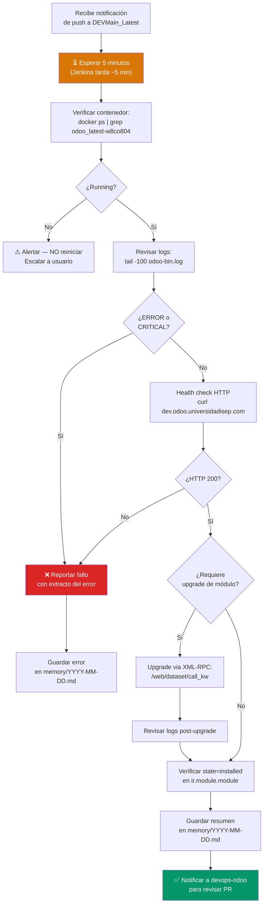

**Entorno DEV:**

| Parámetro | Valor |
|-----------|-------|
| Servidor | 189.195.191.16 (SSH) |
| Contenedor Odoo | `odoo_latest-w8co804sck0ssc0swkcgw488` |
| Logs | `/data/coolify/services/w8co804.../log/odoo-bin.log` |
| URL | `https://dev.odoo.universidadisep.com` |
| RPC DB | `final` |

---

## 🚀 devops-odoo

**Propósito:** Revisar Pull Requests de `DEVMain_Latest → main`, validar el deploy en Producción y gestionar emergencias en la rama de desarrollo.

**Heartbeat:** 60 min (FASE 1 automática)

**Skills disponibles:**

| Skill | Invocación | Automática |
|-------|-----------|-----------|
| `revertir-devmain` | Solo por humano | ⛔ Nunca |

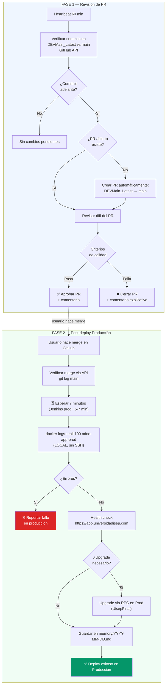

**Criterios de revisión de PR:**

| Criterio | ✅ Aprobado | ❌ Rechazado |
|----------|------------|-------------|
| Alcance | Solo cambios en `addons_uisep` | Modifica core de Odoo |
| Seguridad | Sin credenciales hardcodeadas | Tokens/passwords en código |
| Python | Convenciones Odoo, sin SQL raw sin sanitizar | SQL injection, código inseguro |
| XML | XMLs bien formados | XML inválido |
| Versionado | `__manifest__.py` con `16.0.x.y.z` | Versión incorrecta |
| Operaciones | Sin operaciones destructivas sin control | `unlink` masivo sin guard |

**Ambientes:**

| Ambiente | Acceso | Contenedor |
|----------|--------|-----------|
| DEV | SSH a 189.195.191.16 | `odoo_latest-w8co804sck0ssc0swkcgw488` |
| Producción | LOCAL (sin SSH) | `odoo-app-prod` |

### Skill: revertir-devmain

Revierte `DEVMain_Latest` al último commit de `main`. Se usa cuando hay commits incorrectos o no autorizados en la rama de desarrollo.

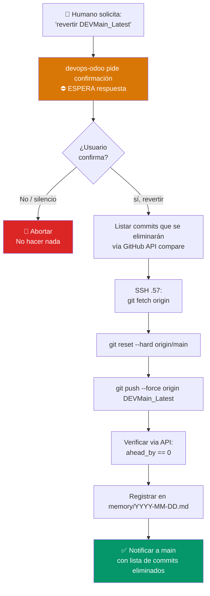

**Cómo invocarla** — el humano debe decir explícitamente alguna de estas frases:
- `"revertir DEVMain_Latest"`
- `"resetear la rama de dev a main"`
- `"limpiar DEVMain_Latest"`
- `"ejecutar skill revertir-devmain"`

**Garantías:**
- Pide confirmación antes de ejecutar
- Lista los commits que se eliminarán antes del force push
- Registra la operación en memoria con los commits afectados
- ⛔ Nunca se ejecuta por heartbeat, cron ni invocación de otro agente

---

## 🎫 incidencias-odoo

**Propósito:** Atender tickets del proyecto Incidencias TI (proyecto ID=53) en Odoo.

**Heartbeat:** 30 min vía cron job `incidencias-autonomas`

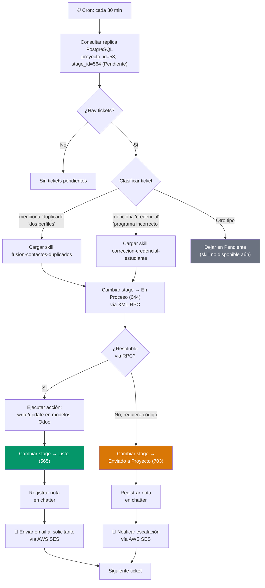

**Stages del proyecto 53:**

| Stage | ID | Descripción |
|-------|----|-------------|
| Pendiente | 564 | Tickets sin procesar |
| En Proceso | 644 | Siendo atendido |
| Listo | 565 | Resuelto via RPC |
| En Revisión | 567 | Requiere clarificación |
| Enviado a Proyecto | 703 | Requiere desarrollo |
| Anulado | 643 | Cancelado |

**Skills disponibles:**

| Skill | Activación | Acción |
|-------|-----------|--------|
| `fusion-contactos-duplicados` | "duplicado", "dos perfiles", "dos cuentas" | Fusiona perfiles en Odoo |
| `correccion-credencial-estudiante` | "credencial", "programa incorrecto", "carnet" | Corrige datos del estudiante |
| `notificacion-incidencia` | Siempre al cambiar stage | Envía email por AWS SES |

**Accesos:**

| Recurso | Tipo | Endpoint |
|---------|------|----------|
| Lectura tickets | PostgreSQL read-only | Réplica en servidor .57 |
| Escritura Odoo | XML-RPC | `https://app.universidadisep.com` |

---

## 📋 dev-project-creator

**Propósito:** Convertir tickets de alta complejidad y solicitudes del área de innovación en proyectos formales de desarrollo.

**Heartbeat:** 60 min

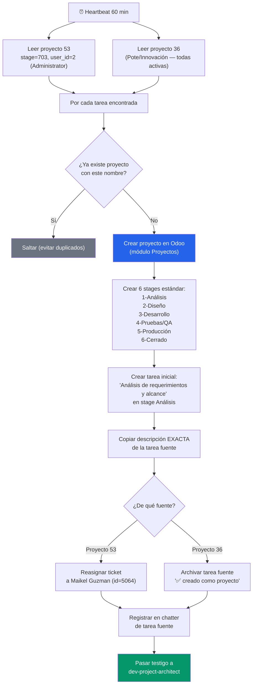

**Reglas clave:**
- ✅ `search_count` ANTES de crear (evitar duplicados)
- ✅ Primera tarea SIEMPRE "Análisis de requerimientos y alcance"
- ✅ Descripción IDÉNTICA a la fuente sin modificaciones
- ⛔ Si falla la creación, NO modificar la tarea fuente

---

## 🏛️ dev-project-architect

**Propósito:** Analizar nuevos proyectos y asignar la herramienta tecnológica óptima del stack UISEP.

**Heartbeat:** 60 min

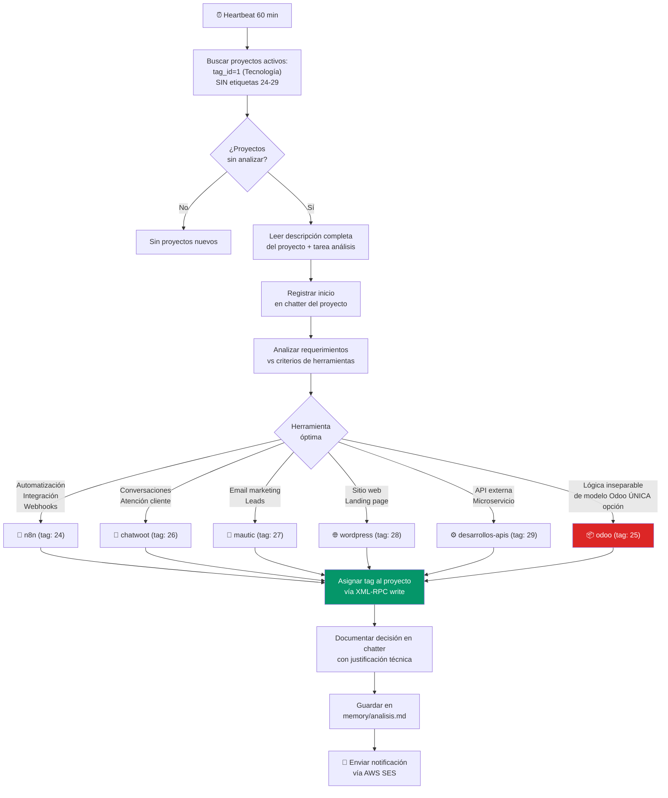

**Problemas de Odoo 16 que considera (para evitar asignarlo):**

| Problema | Descripción |
|----------|-------------|
| OOM Kill | Kernel mata proceso cuando memoria se agota |
| Workers idle bloqueados | Consumen memoria sin liberar |
| Procesos en fallo recursivos | Bucle de error degrada servicio |
| Sobrecarga módulos | slide/mail/livechat consumen RAM desproporcionadamente |
| Arquitectura monolítica | No escala horizontalmente por módulo |

**Herramientas disponibles:**

| Tag ID | Herramienta | Usar cuando |
|--------|-------------|-------------|
| 24 | n8n | Automatizaciones, flujos, integraciones, webhooks |
| 25 | odoo | Lógica inseparable del modelo Odoo (ÚLTIMA opción) |
| 26 | chatwoot | Gestión de conversaciones, atención al cliente |
| 27 | mautic | Email marketing, campañas, leads, nutrición |
| 28 | wordpress | Sitios web, landing pages, portales públicos |
| 29 | desarrollos-apis | APIs, microservicios, integraciones externas |
