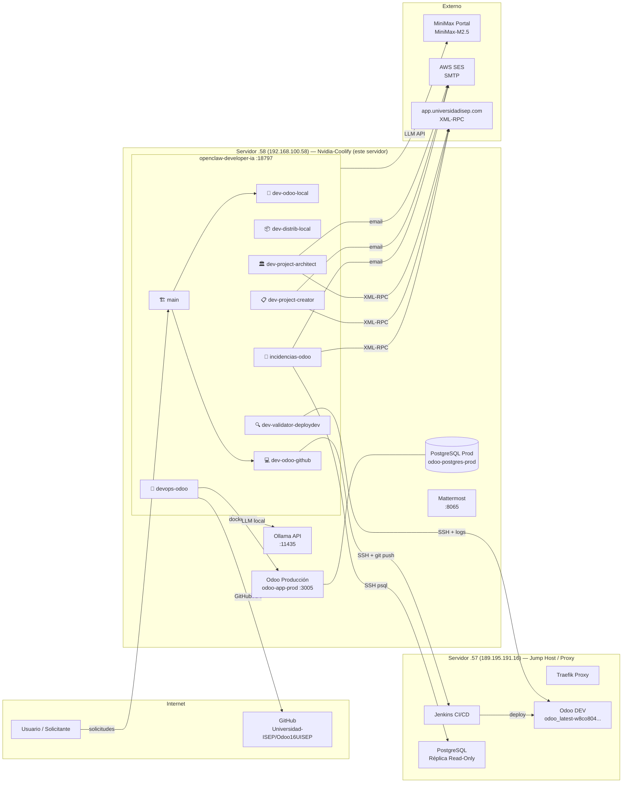
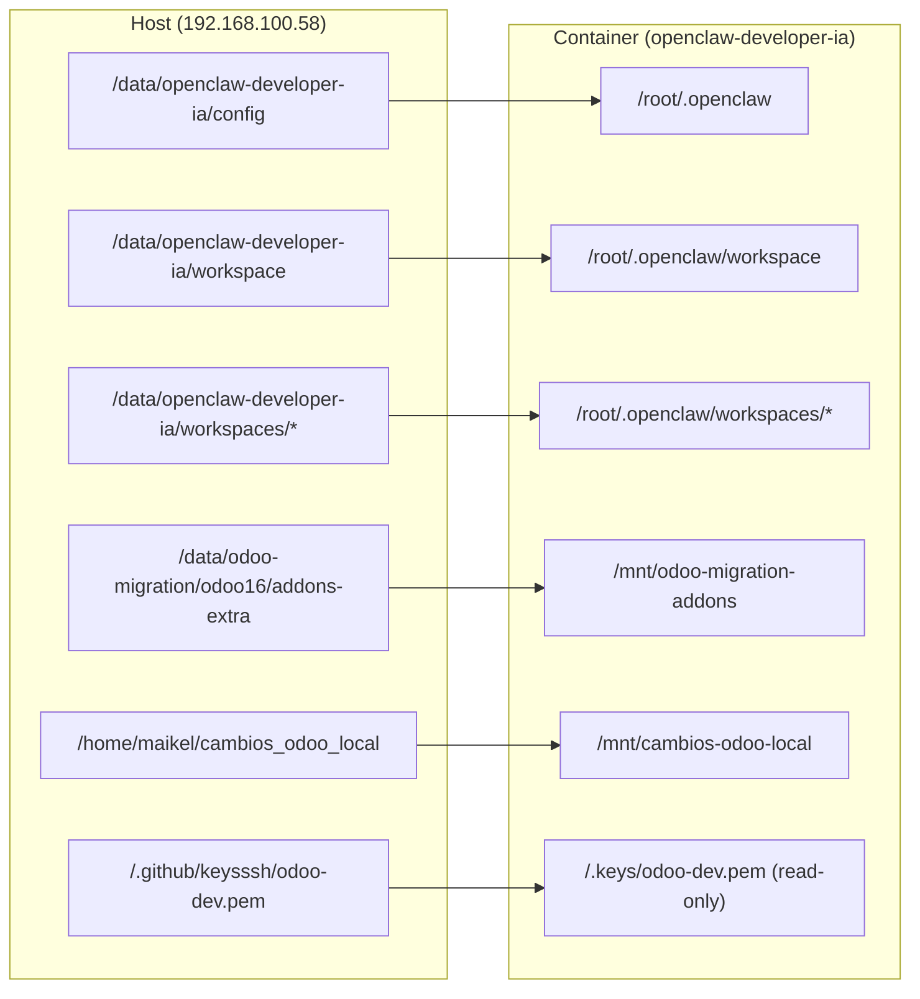
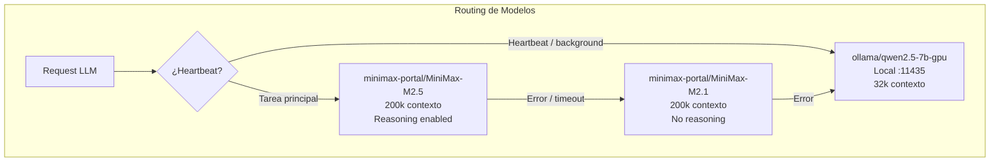
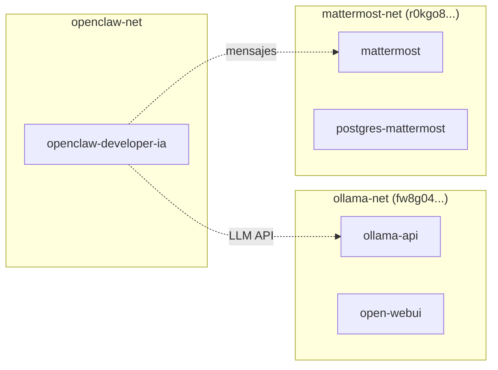

# Arquitectura del Sistema

## Visión de Alto Nivel



---

## Estructura de Directorios

```
/data/openclaw-developer-ia/
│
├── 📄 Dockerfile                    # Imagen: node:22-slim + openclaw@latest
├── 📄 docker-compose.yml            # Definición del servicio
├── 📄 .env                          # Tokens y credenciales (NO versionado)
│
├── 📁 config/                       # Configuración persistente (→ /root/.openclaw)
│   ├── openclaw.json                # Config principal: modelos, agentes, canales
│   ├── cron/
│   │   └── jobs.json                # Cron jobs programados
│   ├── agents/                      # Datos por agente (sessions, auth, modelos)
│   │   ├── main/
│   │   ├── dev-odoo-github/
│   │   ├── dev-odoo-local/
│   │   ├── dev-distrib-local/
│   │   ├── dev-validator-deploydev/
│   │   ├── devops-odoo/
│   │   ├── incidencias-odoo/
│   │   ├── dev-project-creator/
│   │   └── dev-project-architect/
│   └── canvas/
│       └── index.html               # UI de control
│
├── 📁 workspace/                    # Workspace del agente principal
│   ├── SOUL.md                      # Instrucciones de comportamiento
│   ├── IDENTITY.md                  # Identidad y contexto
│   ├── RULES.md                     # Reglas estrictas de operación
│   ├── TOOLS.md                     # Herramientas y conexiones disponibles
│   ├── AGENTS.md                    # Lista y roles de sub-agentes
│   ├── BOOTSTRAP.md                 # Contexto de arranque
│   └── MEMORY.md                    # Memoria de largo plazo
│
├── 📁 workspaces/                   # Workspaces de sub-agentes
│   ├── dev-odoo-github/
│   ├── dev-odoo-local/
│   ├── dev-distrib-local/
│   ├── devops-odoo/
│   ├── dev-validator-deploydev/
│   ├── incidencias-odoo/
│   │   ├── skills/
│   │   │   ├── fusion-contactos-duplicados/SKILL.md
│   │   │   ├── correccion-credencial-estudiante/SKILL.md
│   │   │   └── notificacion-incidencia/SKILL.md
│   │   ├── procesar.js
│   │   ├── procesar_ticket.py
│   │   └── rpc.js
│   ├── dev-project-creator/
│   │   ├── skills/
│   │   │   └── crear-proyecto-desde-fuente/SKILL.md
│   │   └── cron/
│   │       ├── run.py
│   │       └── email_template.html
│   ├── dev-project-architect/
│   │   ├── skills/
│   │   │   └── analizar-proyecto/
│   │   │       ├── SKILL.md
│   │   │       └── analizar_proyecto.js
│   │   ├── analizar_proyecto.py
│   │   └── memory/
│   ├── dev-validator-deploydev/
│   │   └── check_odoo.py
│   └── DOCUMENTACION_AGENTES.md
│
├── 📁 memory/                       # Memoria global del sistema
│   └── analisis.md                  # Log de proyectos analizados
│
└── 📁 sessions/                     # Sessions de ejecución (NO versionado)
```

---

## Volúmenes Montados (Docker)



---

## Configuración de Modelos



| Modelo | Proveedor | Contexto | Reasoning | Uso |
|--------|-----------|----------|-----------|-----|
| MiniMax-M2.5 | minimax-portal | 200k | ✅ | Principal |
| MiniMax-M2.5-highspeed | minimax-portal | 200k | ✅ | Alta velocidad |
| MiniMax-M2.1 | minimax-portal | 200k | ❌ | Fallback 1 |
| qwen2.5-7b-gpu | ollama (local) | 32k | ❌ | Heartbeats / Fallback 2 |

---

## Redes Docker



---

## Límites del Sistema

| Parámetro | Valor |
|-----------|-------|
| Agentes concurrentes | 50 |
| Sub-agentes por agente | 15 hijos |
| Profundidad de spawn | 3 niveles |
| Timeout por tarea | 86400s (24h) |
| Timeout sub-agente | 900s (15min) |
| Bootstrap máximo | 30,000 caracteres |
| Historial contexto | TTL 30 min (cache) |
| Soft trim | 4,000 caracteres |
