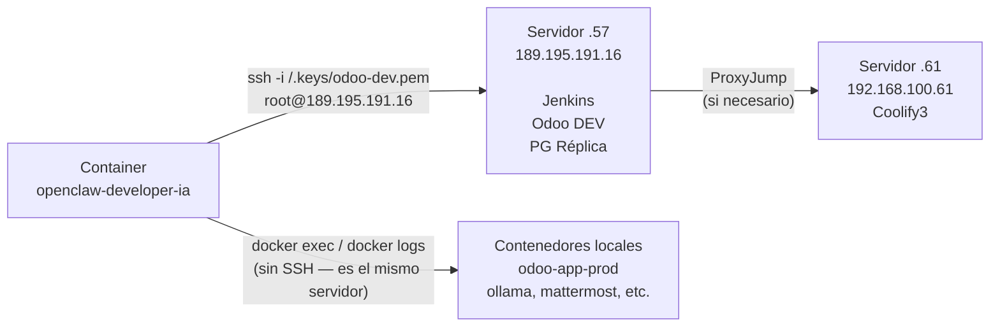
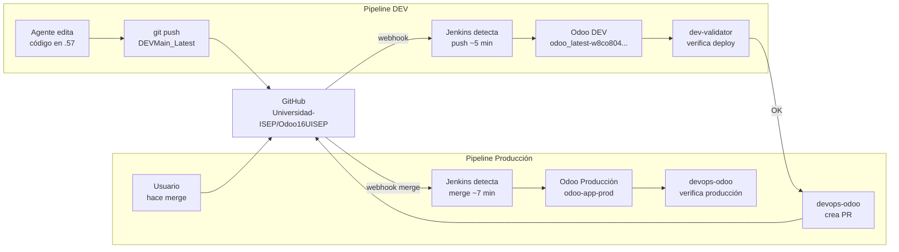

# Infraestructura y Conexiones

## Mapa de Servidores

```mermaid
graph TB
    subgraph Internet["🌐 Internet"]
        USERS[Usuarios / Solicitantes]
        GH[GitHub\ngithub.com/Universidad-ISEP/Odoo16UISEP]
    end

    subgraph S57["🖥️ Servidor .57 — 189.195.191.16 (Jump Host / Proxy)"]
        TRAEFIK_57[Traefik Proxy\nHTTPS → backends]
        JENKINS[Jenkins CI/CD\njenkins-c8kwgocc4coc8swkksco4kko\nhttps://jenkins.universidadisep.com]
        ODOO_DEV[Odoo DEV\nodoo_latest-w8co804sck0ssc0swkcgw488\nhttps://dev.odoo.universidadisep.com]
        PG_DEV[PostgreSQL DEV\npgodoo_latest-w8co804...\nDB: final]
        PG_REPLICA[PostgreSQL Réplica\npostgres-replica-i4s8o8000kc040cgwcwowwwc\nDB: UisepFinal (read-only)]
    end

    subgraph S58["🖥️ Servidor .58 — 192.168.100.58 (Nvidia-Coolify) — Este servidor"]
        OCA[openclaw-developer-ia\n:18797]

        subgraph Odoo_Prod["Odoo Producción"]
            ODOO_PROD[odoo-app-prod\n:3005 → :8069]
            PG_PROD[(odoo-postgres-prod\nDB: UisepFinal)]
            REDIS_PROD[odoo-redis-prod]
        end

        OLLAMA[ollama-api\n:11435]
        MATTERMOST[mattermost\n:8065]
        N8N_4[n8n instancia 4\n:3000]
        N8N_5[n8n instancia 5\n:3002]
    end

    subgraph Externo["☁️ Servicios Externos"]
        MINIMAX[MiniMax Portal API\nhttps://api.minimax.io/anthropic\nMiniMax-M2.5]
        AWS_SES[AWS SES\nemail-smtp.us-east-1.amazonaws.com:587]
        ODOO_APP[https://app.universidadisep.com\nXML-RPC API]
    end

    USERS -->|HTTPS| TRAEFIK_57
    TRAEFIK_57 -->|proxy| ODOO_DEV
    TRAEFIK_57 -->|proxy| S58
    GH -->|webhook push| JENKINS
    JENKINS -->|deploy DEV| ODOO_DEV
    JENKINS -->|deploy Prod| ODOO_PROD

    OCA -->|SSH| S57
    OCA -->|docker directo| ODOO_PROD
    OCA -->|LLM API| MINIMAX
    OCA -->|LLM local| OLLAMA
    OCA -->|email| AWS_SES
    OCA -->|XML-RPC| ODOO_APP

    ODOO_PROD --- PG_PROD
    ODOO_PROD --- REDIS_PROD
```

---

## Contenedores del Sistema (Servidor .58)

| Contenedor | Imagen | Puerto | Red | Propósito |
|-----------|--------|--------|-----|-----------|
| `openclaw-developer-ia` | `openclaw-developer-ia-openclaw-developer-ia` | `18797→18789` | openclaw-net, ollama-net, mattermost-net | Sistema multiagente |
| `odoo-app-prod` | `servidoresuisep/odoo16uisep:latest` | `3005→8069` | — | Odoo producción |
| `odoo-postgres-prod` | `postgres:14` | `5432` (interno) | — | BD Odoo prod |
| `odoo-redis-prod` | `redis:7-alpine` | `6379` (interno) | — | Cache Odoo prod |
| `ollama-api-fw8g04...` | `ollama/ollama:latest` | `11435→11434` | ollama-net | Modelos LLM locales |
| `open-webui-fw8g04...` | `ghcr.io/open-webui/open-webui:main` | `8081→8080` | ollama-net | UI Ollama |
| `mattermost-r0kgo8...` | `mattermost/mattermost-team-edition` | `8065` | mattermost-net | Chat corporativo |
| `n8n-o4kswog4...` | `n8nio/n8n:1.123.11` | `3002→5678` | — | n8n instancia 5workflow |
| `n8n-ycgw08so...` | `n8nio/n8n:1.123.11` | `3000→5678` | — | n8n instancia 4workflow |
| `coolify-proxy` | `traefik:v3.1` | `80, 443, 8080` | — | Reverse proxy |

---

## Conexiones SSH



**Llave SSH disponible en el container:**

| Llave | Ruta en container | Permisos | Acceso a |
|-------|------------------|---------|---------|
| `odoo-dev.pem` | `/.keys/odoo-dev.pem` | read-only | Servidor .57 |

---

## Acceso a Odoo vía XML-RPC

```python
import xmlrpc.client

# Producción
URL = "https://app.universidadisep.com"
DB  = "UisepFinal"
UID = 5064  # iallamadas@universidadisep.com

common = xmlrpc.client.ServerProxy(f"{URL}/xmlrpc/2/common")
models = xmlrpc.client.ServerProxy(f"{URL}/xmlrpc/2/object")

# Buscar registros
records = models.execute_kw(DB, UID, PASSWORD, 'model.name', 'search_read',
    [[['field', '=', 'value']]],
    {'fields': ['id', 'name'], 'limit': 10}
)

# Escribir
models.execute_kw(DB, UID, PASSWORD, 'model.name', 'write',
    [[record_id], {'field': 'new_value'}]
)
```

**Endpoints importantes:**

| Recurso | Método | Descripción |
|---------|--------|-------------|
| `project.project` | `search_read` | Buscar proyectos |
| `project.task` | `search_read` | Leer tickets/tareas |
| `project.task` | `write` | Actualizar stage, asignado |
| `ir.module.module` | `button_immediate_upgrade` | Actualizar módulo |
| `res.partner` | `search_read` / `write` | Gestión de contactos |
| `mail.thread` | `message_post` | Registrar en chatter |

---

## Flujo de CI/CD



---

## Variables de Entorno y Credenciales

> Las credenciales reales se almacenan en el archivo `.env` del servidor y en `config/agents/*/auth-profiles.json`.  
> En el repositorio se usan los siguientes placeholders:

| Variable | Descripción | Usada por |
|----------|-------------|-----------|
| `${GITHUB_TOKEN}` | GitHub PAT con acceso `repo` y `workflow` | dev-odoo-github, dev-distrib-local, devops-odoo |
| `${ODOO_RPC_PASSWORD}` | Contraseña XML-RPC (usuario: `iallamadas@universidadisep.com`) | Todos los agentes con RPC |
| `${ODOO_DB_PASSWORD}` | Contraseña PostgreSQL local (usuario: `odoo`) | dev-odoo-local |
| `OPENCLAW_GATEWAY_TOKEN` | Token de autenticación del gateway | En `.env` del contenedor |
| MiniMax OAuth | Token OAuth para MiniMax-M2.5 | En `config/agents/main/auth-profiles.json` |

---

## Dominios y URLs

| Dominio | Backend | Servicio |
|---------|---------|---------|
| `app.universidadisep.com` | odoo-app-prod :3005 | Odoo Producción |
| `dev.odoo.universidadisep.com` | .57 → odoo_latest-w8co804... | Odoo DEV |
| `dev3.odoo.universidadisep.com` | .58 local | Odoo Local (migration) |
| `jenkins.universidadisep.com` | .57 → jenkins-c8kwgocc... | Jenkins CI/CD |
| `matter.universidadisep.com` | .58 :8065 | Mattermost |
| `ollama.universidadisep.com` | .58 :8081 | Open WebUI Ollama |
| `4workflow.universidadisep.com` | .58 :3000 | n8n instancia 4 |
| `5workflow.universidadisep.com` | .58 :3002 | n8n instancia 5 |
| `web4.universidadisep.com` | .58 :3007 | OpenClaw Web4 |
