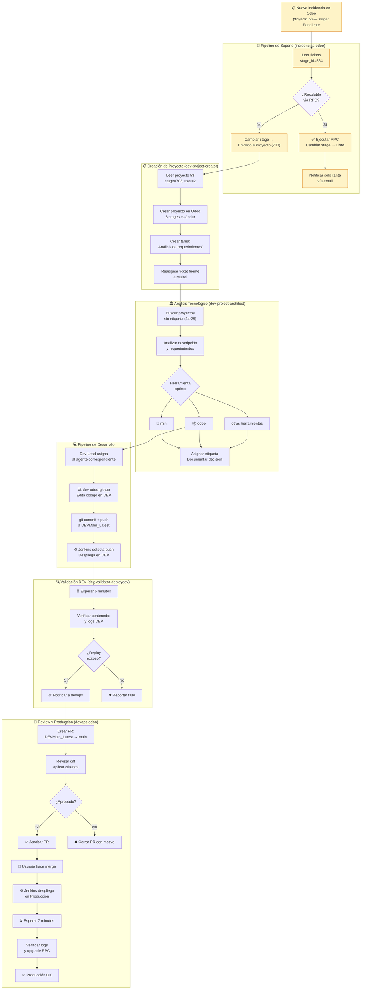
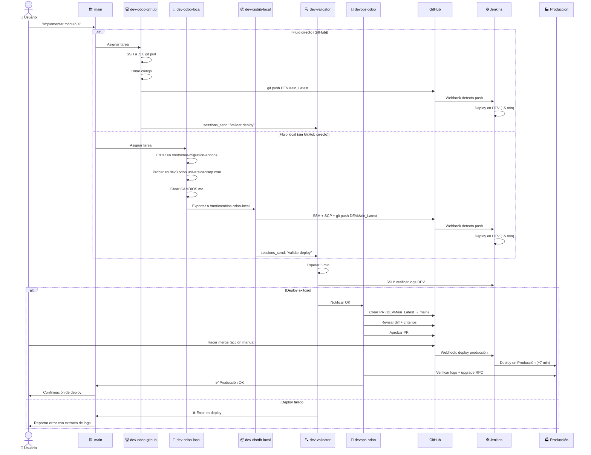
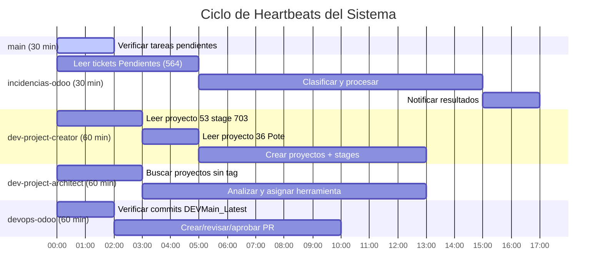
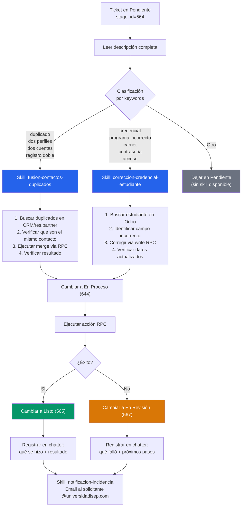
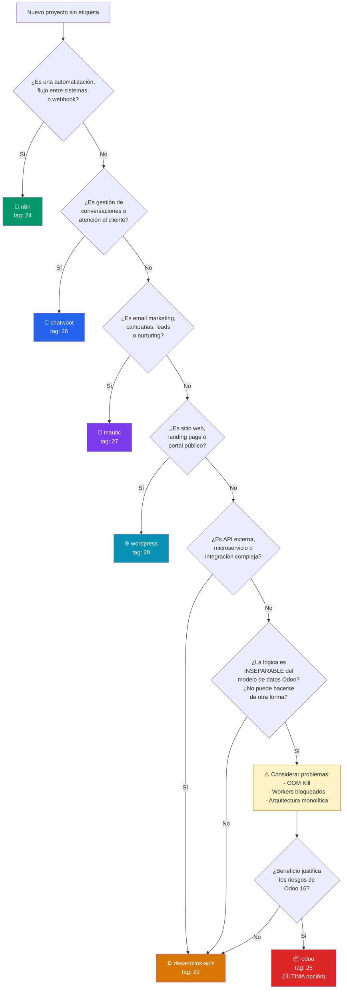
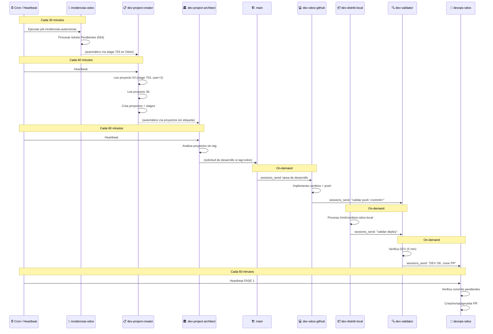

# Workflows — Diagramas de Flujo

## 1. Pipeline Completo: Incidencia → Producción

---

## 2. Flujo de Desarrollo: Local → DEV → Producción

---

## 3. Ciclo de Heartbeats

---

## 4. Clasificación y Procesamiento de Tickets

---

## 5. Decisión de Herramienta Tecnológica

---

## 6. Validación de Deploy DEV + Producción

```mermaid
flowchart TD
    subgraph DEV["Validación DEV"]
        D_PUSH["Push a DEVMain_Latest"]
        D_WAIT["⏳ Esperar 5 min\n(Jenkins DEV)"]
        D_CONTAINER["docker ps | grep odoo_latest-w8co804"]
        D_LOGS["tail -100 odoo-bin.log\nbuscar: ERROR|CRITICAL"]
        D_HTTP["curl https://dev.odoo.universidadisep.com\nesperado: HTTP 200"]
        D_STATE["XML-RPC: verificar\nir.module.module state=installed"]
        D_OK["✅ DEV OK\n→ Crear PR"]
        D_FAIL["❌ DEV Fallo\n→ Reportar al usuario"]
    end

    subgraph PROD["Validación Producción"]
        P_MERGE["Merge en GitHub"]
        P_WAIT["⏳ Esperar 7 min\n(Jenkins Producción)"]
        P_CONTAINER["docker logs --tail 100 odoo-app-prod\n(LOCAL — sin SSH)"]
        P_HTTP["curl https://app.universidadisep.com\nesperado: HTTP 200"]
        P_UPGRADE{¿Módulo\nnecesita upgrade?}
        P_RPC["XML-RPC upgrade:\ndb=UisepFinal, uid=5064"]
        P_POST_LOGS["Revisar logs post-upgrade"]
        P_OK["✅ Producción OK"]
        P_FAIL["❌ Producción Fallo\n→ Reportar urgente"]
    end

    D_PUSH --> D_WAIT --> D_CONTAINER --> D_LOGS
    D_LOGS -->|Sin errores| D_HTTP
    D_LOGS -->|Con errores| D_FAIL
    D_HTTP -->|200| D_STATE
    D_HTTP -->|No 200| D_FAIL
    D_STATE -->|installed| D_OK
    D_STATE -->|No instalado| D_FAIL

    P_MERGE --> P_WAIT --> P_CONTAINER --> P_HTTP
    P_HTTP -->|200| P_UPGRADE
    P_HTTP -->|No 200| P_FAIL
    P_UPGRADE -->|Sí| P_RPC --> P_POST_LOGS --> P_OK
    P_UPGRADE -->|No| P_OK

    style D_OK fill:#059669,color:#fff
    style D_FAIL fill:#dc2626,color:#fff
    style P_OK fill:#059669,color:#fff
    style P_FAIL fill:#dc2626,color:#fff
```

---

## 7. Comunicación entre Agentes

